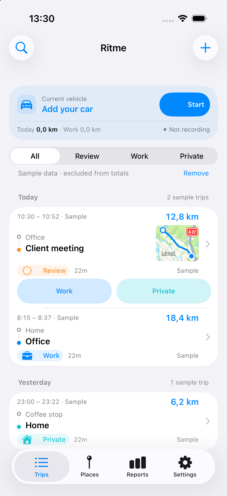
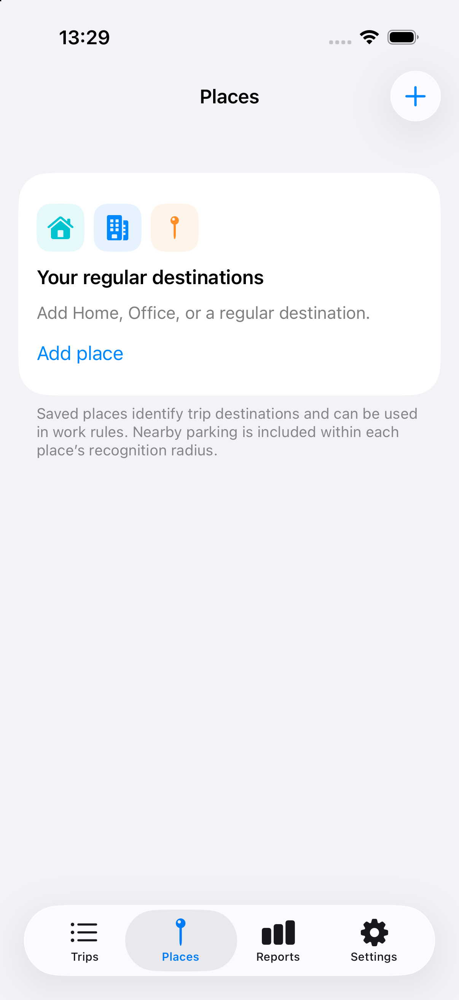
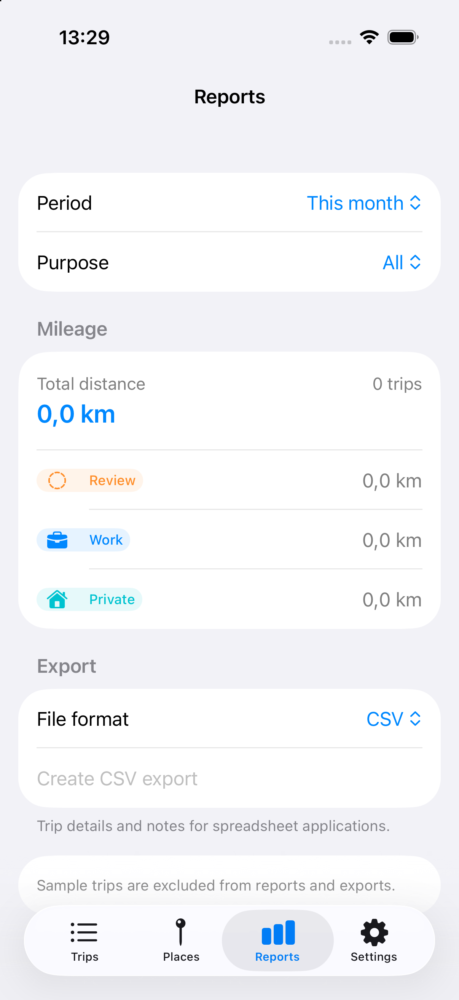
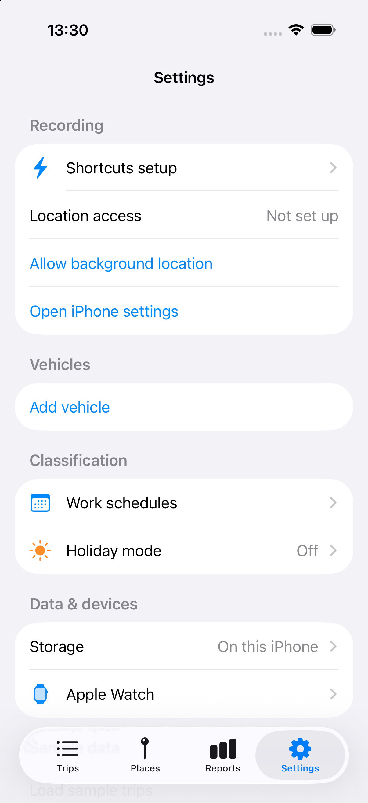

# Ritme

A native iPhone mileage logger with trip recording, Work/Private classification, saved places, work schedules, holiday mode and mileage exports. Built with SwiftUI and SwiftData, using native navigation, a compact vehicle panel, dense daily trip groups, colored purpose labels and a latest-trip map thumbnail. **Ritme is a working name.** All code and artwork are original.

## Install the development beta

Download the unsigned iPhone IPA from [Releases](https://github.com/MiranoVerhoef/Ritme/releases), or add the following source in a compatible AltStore Classic, SideStore or FlareStore installation:

```text
https://raw.githubusercontent.com/MiranoVerhoef/Ritme/main/altstore-source.json
```

Requires **iOS 26 or later**. Your installer signs the IPA for your device. Read the [installation and release guide](Distribution/README.md) for setup, refresh requirements and Watch installation.

This beta stores data locally. iCloud sync is not active. The sideload package is iPhone-only; the repository includes the Watch target for signed Xcode builds. Physical driving and paired-Watch testing remain necessary.

## Interface

Screenshots use explicitly labeled sample trips, which are excluded from reports.

| Trips | Places | Reports | Settings |
| --- | --- | --- | --- |
|  |  |  |  |

## Run it

Open `Ritme.xcodeproj` in Xcode 27, select the **Ritme** scheme, choose an iPhone simulator and press Run. The iPhone target requires iOS 26 or later. The Watch companion targets watchOS 11 or later.

On first launch choose **Continue** or **Load sample trips**. Sample trips are explicitly labeled, excluded from real mileage and reports, and removable in Settings. `--demo` is also available as a launch argument for simulator previews. `--preview-tab=0` through `3` starts on Trips, Places, Reports, or Settings.

To run on your iPhone, select your Apple developer team for both Ritme and RitmeWatch in Signing & Capabilities. Change both bundle identifiers if necessary, and update `WKCompanionAppBundleIdentifier` in the Watch Info.plist to match the iPhone identifier. Choose your connected iPhone and Run. For ongoing beta distribution use your own signed TestFlight build.

## Implemented

- SwiftUI Trips, Places, Reports and Settings screens, with a separate first-launch welcome.
- SwiftData local persistence; storage failures are surfaced rather than silently discarding data.
- Start/finish GPS recording, background-location configuration, poor-fix/stale-fix/jump filtering, route maps and unfinished-trip recovery controls.
- Work/Private marking with explanations and timestamp-based protection against delayed Watch edits overwriting newer choices.
- Manual trips with date, duration, entered mileage and purpose; editable notes.
- Vehicles, current vehicle selection and a manual odometer reference.
- Apple Maps place search and editable recognition radii. First and last GPS fixes are matched to destinations, not intermediate route passages.
- Work schedules with selected weekdays, overnight intervals and optional arrival-place requirements.
- Holiday mode with a return date. Manual choices always win. Rules apply when recording finishes and do not retroactively reclassify history.
- Search and purpose filters; month/year/all-time mileage reports.
- CSV, PDF and GPX files with native sharing. GPX excludes manual trips with no GPS track; CSV escapes formula-like user content.
- Start Trip, End Trip and Mark Trip App Intents. Start/end deliberately open the app in this beta.
- CarPlay/Bluetooth automation setup instructions and test controls. The user must create the personal automations in Shortcuts; these are guided presets, not one-click installed automations.
- Watch app with current/latest real-trip Work and Private controls. Changes retain their trip ID, queue for delivery, and are acknowledged by the iPhone. Pending commands persist on the Watch.
- An original app icon and no third-party runtime dependencies.

## Deliberately unfinished

This is a first beta, not a production trip recorder. Real iPhone driving tests are required for locked-screen capture, battery usage, GPS distance accuracy, permissions and Shortcut triggers. The simulator cannot establish these guarantees.

Automatic motion-based start/stop detection, delayed-stop grouping, geocoded street names for unknown endpoints, frequent-place suggestions, speed playback, bulk editing, OBD integration, odometer scanning, widgets, Live Activities and a dedicated CarPlay interface are not implemented. Unknown recorded endpoints show coordinates until saved as places. GPS recording does not promise to survive force quitting; unfinished trips offer resume/finish controls on relaunch. Starting and ending by Shortcut opens Ritme, rather than claiming silent recording works before device validation.

The Watch target compiles and is embedded in Xcode builds; the iPhone sideload package omits it. Real paired-device delivery has not been tested; no watchOS simulator runtime is installed on the build Mac. Connection acknowledgments and queued changes need physical Watch testing.

## iCloud preparation

The default build uses a **local** SwiftData store. It does not claim active iCloud sync. An optional CloudKit configuration is included but has not been provisioned or tested:

1. Set your developer team and your own bundle IDs.
2. Add iCloud/CloudKit and Push Notifications capabilities to the iPhone target using Xcode. `Ritme/Resources/Ritme.entitlements` is a starting template; select/create a container owned by your team.
3. Point Code Signing Entitlements at the configured file and set `RitmeCloudEnabled` to true in Info.plist. The app then selects SwiftData's automatic CloudKit configuration.
4. Test on two signed devices, initialize the development schema, and validate conflict handling before publishing a production schema.

Cloud sync progress and confirmed upload timestamps are not implemented. Large GPS route blobs and local-to-cloud migration require further work; do not enable this experimental option on your only copy of important trips.

## Validation

Build/test without a signing account:

```sh
xcodebuild -project Ritme.xcodeproj -scheme Ritme \
  -destination 'platform=iOS Simulator,name=iPhone 17 Pro,OS=26.5' \
  -derivedDataPath build/DerivedData CODE_SIGNING_ALLOWED=NO test
```

Tests cover arrival-place rules, holidays/return boundaries, overnight weekdays, invalid GPS fixes, manual overrides, out-of-order classification changes, demo isolation, export escaping, the recording-to-classification pipeline and reopening a persistent store.

`Scripts/generate_project.py` regenerates the checked-in Xcode project without XcodeGen or external packages. `Scripts/generate_assets.py` regenerates the checked-in original app icon using Pillow; it is not needed to build the app.
